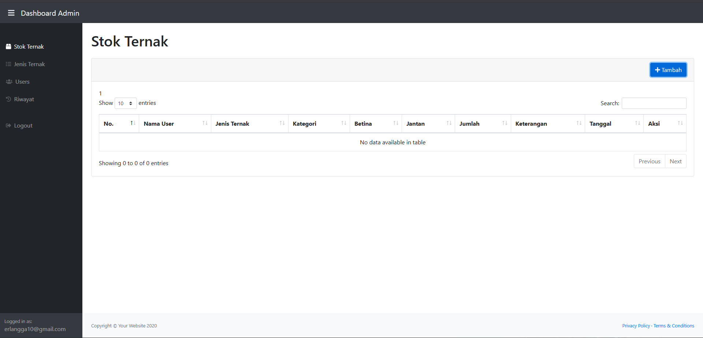

# Sistem Informasi Peternakan - Proker KKN

Aplikasi web sederhana untuk monitoring stok ternak, jenis ternak, dan riwayat perubahan.

## Fitur
- Login admin dengan validasi
- CRUD Stok Ternak
- CRUD Jenis Ternak
- Manajemen User
- Riwayat perubahan
- Hapus semua riwayat dengan konfirmasi password

## Teknologi
- PHP Native
- MySQL
- Bootstrap 4
- JavaScript

## Demo

> Proyek ini dibuat untuk kegiatan KKN.
